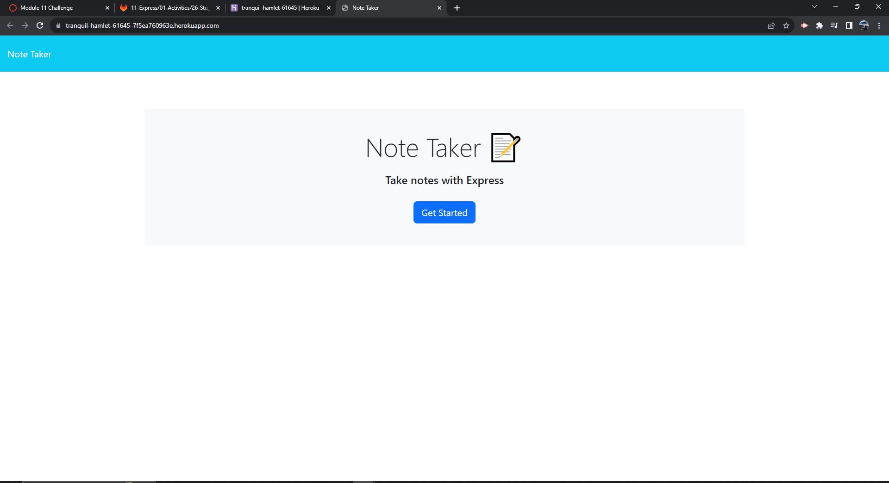

# Note Taker

## Description

This project was built in order to provide the user with an application that allows for creation, saving, and deleting of notes. This application provides very functional but easy to use features. Building this solidifed my knowledge of routes, running a server, using different requests on insomnia to ensure functionality, tying a front end to a back end, and much more.

## Usage

## Credits

W3 Schools, MDN Docs, NPM documentation, Stack Overflow, Insomnia documentation

## License

MIT License